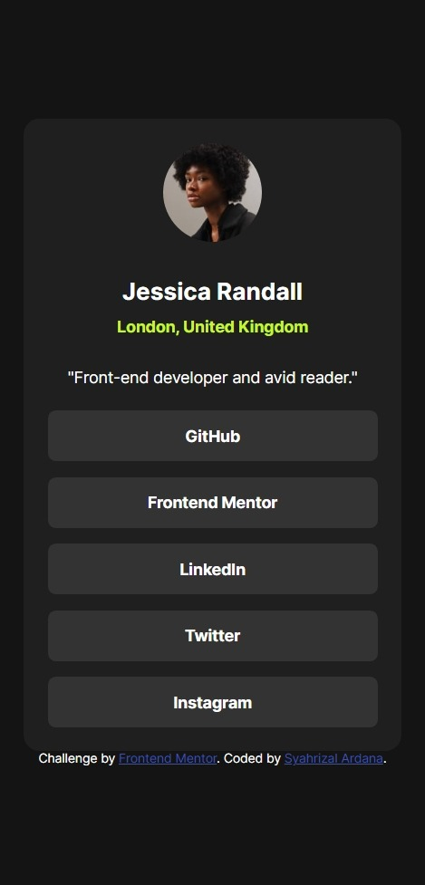
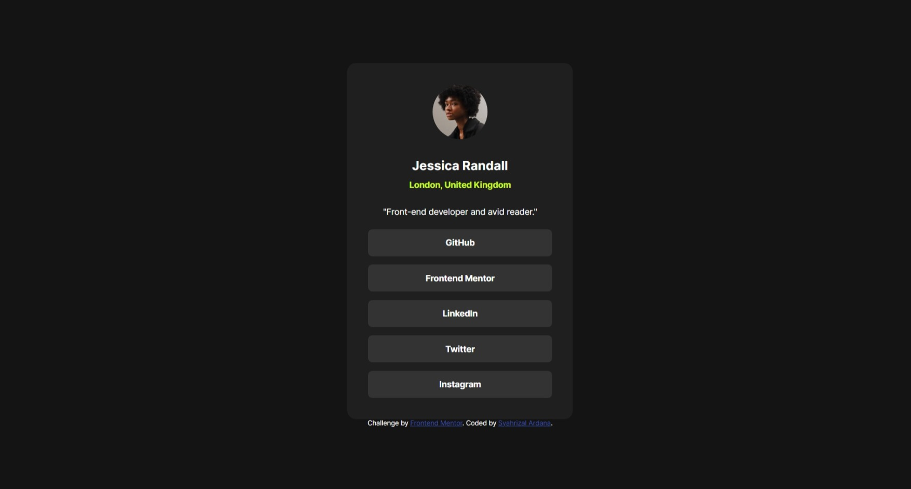
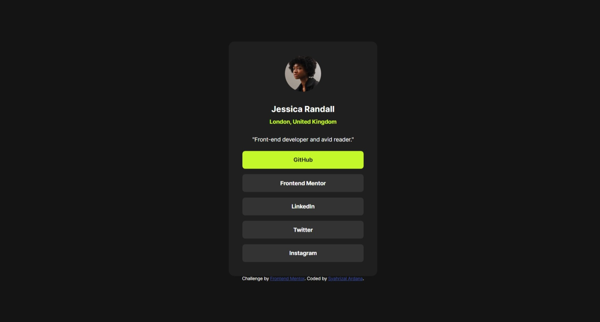

# Frontend Mentor - Social links profile solution

This is a solution to the [Social links profile challenge on Frontend Mentor](https://www.frontendmentor.io/challenges/social-links-profile-UG32l9m6dQ). Frontend Mentor challenges help you improve your coding skills by building realistic projects.

## Table of contents

- [Overview](#overview)
  - [Screenshot](#screenshot)
  - [Links](#links)
- [My process](#my-process)
  - [Built with](#built-with)
- [Author](#author)

## Overview

### Screenshot

---

---

### Links

- Solution URL: [https://www.frontendmentor.io/solutions/recipe-page-flexbox-scss-media-query-MLlmkc0CKF](https://www.frontendmentor.io/solutions/recipe-page-flexbox-scss-media-query-MLlmkc0CKF)
- Live Site URL: [https://fm-recipe-page-eight.vercel.app](https://fm-recipe-page-eight.vercel.app)

## My process

### Built with

- Semantic HTML5 markup
- Flexbox
- Mobile-first workflow
- [SCSS](https://sass-lang.com/) - For styles

## Author

- Website - [Syahrizal Ardana](https://syahrizal-portfolio.vercel.app)
- Frontend Mentor - [@Gombeng](https://www.frontendmentor.io/profile/Gombeng)
